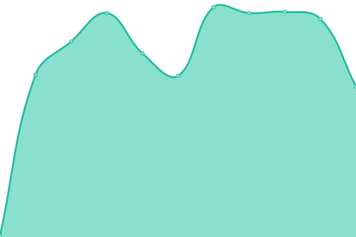
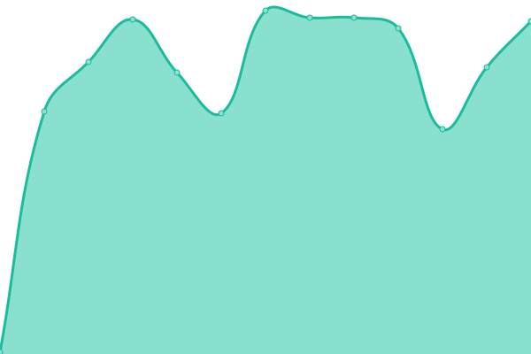
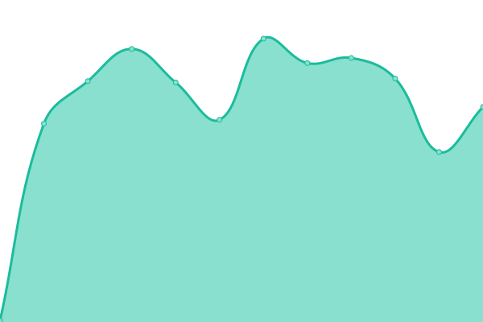

# [📈 Live Status](https://uptime.ecommerce.com): <!--live status--> **🟥 Complete outage**

This repository contains the open-source uptime monitor and status page for [dlask913](https://uptime.ecommerce.com), powered by [Upptime](https://github.com/upptime/upptime).

With [Upptime](https://upptime.js.org), you can get your own unlimited and free uptime monitor and status page, powered entirely by a GitHub repository. We use [Issues](https://github.com/dlask913/upptime/issues) as incident reports, [Actions](https://github.com/dlask913/upptime/actions) as uptime monitors, and [Pages](https://uptime.ecommerce.com) for the status page.

<!--start: status pages-->
<!-- This summary is generated by Upptime (https://github.com/upptime/upptime) -->
<!-- Do not edit this manually, your changes will be overwritten -->
<!-- prettier-ignore -->
| URL | Status | History | Response Time | Uptime |
| --- | ------ | ------- | ------------- | ------ |
|  [member-service/main](http://ec2-43-200-95-178.ap-northeast-2.compute.amazonaws.com:8000/member-service/main) | 🟥 Down | [member-service-main.yml](https://github.com/dlask913/upptime/commits/HEAD/history/member-service-main.yml) | 

 0ms
     
 | 

<a href="https://dlask913.github.io/upptime/history/member-service-main">0.00%</a>
    

|  [member-service/new](http://ec2-43-200-95-178.ap-northeast-2.compute.amazonaws.com:8000/member-service/new) | 🟥 Down | [member-service-new.yml](https://github.com/dlask913/upptime/commits/HEAD/history/member-service-new.yml) | 

 0ms
     
 | 

<a href="https://dlask913.github.io/upptime/history/member-service-new">0.00%</a>
    

|  [member-service/login](http://ec2-43-200-95-178.ap-northeast-2.compute.amazonaws.com:8000/member-service/login) | 🟥 Down | [member-service-login.yml](https://github.com/dlask913/upptime/commits/HEAD/history/member-service-login.yml) | 

 0ms
     
 | 

<a href="https://dlask913.github.io/upptime/history/member-service-login">0.00%</a>
    

|  [order-service/orders](http://ec2-43-200-95-178.ap-northeast-2.compute.amazonaws.com:8000/order-service/orders/**) | 🟥 Down | [order-service-orders.yml](https://github.com/dlask913/upptime/commits/HEAD/history/order-service-orders.yml) | 

 0ms
     
 | 

<a href="https://dlask913.github.io/upptime/history/order-service-orders">0.00%</a>
    

<!--end: status pages-->

[**Visit our status website →**](https://uptime.ecommerce.com)

## 📄 License

- Powered by: [Upptime](https://github.com/upptime/upptime)
- Code: [MIT](./LICENSE) © [dlask913](https://uptime.ecommerce.com)
- Data in the `./history` directory: [Open Database License](https://opendatacommons.org/licenses/odbl/1-0/)
